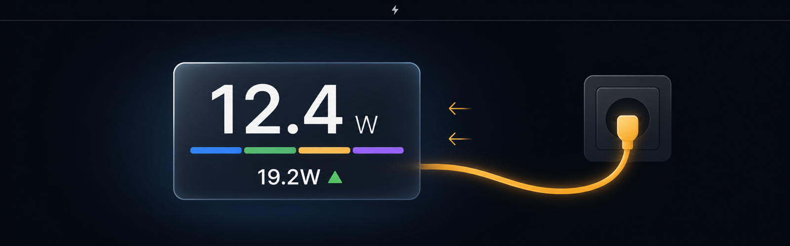
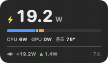
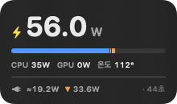
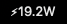

<p align="center">
  
</p>

<h1 align="center">SysWatt</h1>

<p align="center">
  Live Mac power draw in the menu bar and on the desktop, measured in watts.
</p>

<p align="center">
  <a href="https://github.com/yhzion/syswatt/actions/workflows/build.yml"></a>
  
  
  
  
  
  
</p>

<p align="center">
  
</p>

<p align="center"><sub>Concept artwork. Real captures of the shipped interface are in <a href="#preview">Preview</a>.</sub></p>

SysWatt reads the machine's own power counters once per second and shows two
numbers: what the Mac is consuming now, and — while an adapter is attached — how
much is arriving from the wall. There is no helper daemon, no shell-out, no
network traffic, and no elevated privileges. Everything is read in-process
through `IOReport` and `AppleSMC`.

## At a glance

| Surface | V1 behavior |
|---|---|
| Menu bar | One status item, `⚡︎12.4W`, refreshed every second |
| Desktop widget | Translucent panel pinned just above the wallpaper, with the same number plus a per-component bar, `CPU` / `GPU` split and the hottest CPU sensor |
| Power row | Appears only while an adapter is connected: wall input, battery direction, and the age of that measurement |
| Battery flow | Green `▲` for energy into the battery, orange `▼` for energy out of it, nothing at all when neither |
| Polling | One in-process sampler at a fixed 1-second cadence; no child processes |
| Position | Drag it anywhere; the frame is stored and restored |

> [!NOTE]
> The headline number is a machine estimate of system power, not the wattage at
> the wall socket. Switching losses, and parts of the display, SSD and fan load,
> are outside what macOS exposes. Apple Silicon only. Menu and widget labels are
> currently Korean.

## How it works

```text
IOReport "Energy Model"            cumulative mJ / uJ / nJ per block
        │  samples → delta ÷ elapsed
        ▼
PowerSampler ─────────────────────▶ cpu · gpu · ane · ram        (1 s)
        ▲
AppleSMC key "PSTR" ──────────────▶ system power, board-wide     (1 s)
        │
        └── sys_power = max(PSTR, cpu + gpu + ane)
                    │
                    ├──▶ NSStatusItem title
                    └──▶ NSPanel at desktop window level

AppleSmartBattery (IORegistry)     updated by the OS about every 60 s
        │  ExternalConnected gates the whole row
        └──▶ SystemPowerIn · InstantAmperage × Voltage · AdapterDetails.Watts
```

Two measurement domains with different refresh rates are deliberately kept apart
in the interface: the consumption number is one second old, the wall number can
be up to a minute old, so the row prints its own age (`· 42초`). Deriving input
power from `sys_power + battery flow` would look more responsive and would be
wrong, because the two meters cover different loads.

The identity `SystemPowerIn = SystemLoad + BatteryPower` was verified on this
machine, and under a full-core load `wall input + battery discharge` reproduced
the independent `sys_power` reading to within 1 W.

## Preview

Captures are taken from the running app: the widget as a single window and the
menu bar item cropped to its exact accessibility frame. The second image is the
undersized-adapter case — a 20 W charger on an M2 Max under eight busy cores, so
the battery is discharging while plugged in.

<details>
<summary><strong>Open the real interface</strong></summary>
<br>
<table>
  <tr>
    <td></td>
    <td></td>
  </tr>
  <tr>
    <td><sub>Charging — energy into the battery.</sub></td>
    <td><sub>Reverse flow — the adapter cannot cover consumption.</sub></td>
  </tr>
</table>
<br>

</details>

## Requirements

- macOS 14 or newer on Apple Silicon (M1 through M4 family; M5 not tested)
- Xcode or the Swift toolchain, only to build from source
- No sudo, no Full Disk Access, no network access

`IOReport` and `AppleSMC` are read directly. The declarations for the
non-public `IOReport` C functions live in one file,
`Sources/CIOReport/include/CIOReport.h`, which is where you look first if a
future macOS release changes them.

## Build and install

```bash
git clone https://github.com/yhzion/syswatt
cd syswatt
swift build -c release
./package-app.sh
open SysWatt.app
```

`package-app.sh` assembles `SysWatt.app`, writes an `Info.plist` with
`LSUIElement` set, and ad-hoc code-signs the bundle. The app lives in the menu
bar only; there is no Dock tile.

Start at login is a menu item, not an assumption. It writes an ordinary user
`LaunchAgent`, which needs no administrator privileges, pointing at the
executable **inside** the bundle — `launchd` cannot start an `.app` directory and
fails with `EX_CONFIG` (78) if you try:

```bash
~/Library/LaunchAgents/com.yhzion.syswatt.plist
```

Because that entry stores an absolute path, toggle the item off and on again
after moving the app.

## Display behavior

- The headline is `sys_power`: `PSTR` when the SMC exposes it, otherwise the sum
  of the measured SoC blocks.
- The segmented bar under the number is not decoration. Each segment is one
  power domain scaled against the same total, so a blue-only bar means CPU-bound
  and a violet tail means the neural engine is working.
- The power row disappears entirely on battery, and the window shrinks by one
  row while keeping its top edge fixed.
- The adapter rating (`AdapterDetails.Watts`) is the charger's ceiling, not a
  measurement, so it is only reachable from the plug icon's tooltip.
- Energy Model channel names vary by chip (`CPU Energy` versus
  `DIE_0_CPU Energy`, `ANE` versus `ANE0`), so matching is by prefix and suffix
  rather than exact name.

## Moving the widget

A window at desktop window level does not receive mouse events — Finder owns
hit-testing on the desktop — so dragging it is impossible in the default state.
The menu's position command raises the panel to a floating level, lets you drag
it, and returns it to the desktop level a moment after you release the mouse.

The system "Edit Widgets" mode hides this window on purpose. It is a normal
panel, not a WidgetKit widget, so the edit layer covers it and it reappears when
you leave that mode.

## Diagnostics

```bash
.build/release/syswatt --dump      # print watts for 5 seconds, no GUI
.build/release/syswatt --channels  # list this chip's Energy Model channels
.build/release/syswatt --temps     # find CPU temperature keys by load response
```

`--temps` scans every SMC key, spins all cores for eight seconds and reports
which sensors rose the most. On an M2 Max the `Tp*` family climbs about 35 °C
under load, which is why the widget shows the maximum of that family. If your
chip disagrees, this is the command that tells you.

Measured on an M2 Max while running: 2.5% CPU at idle, 1.3% under an eight-core
load, roughly 85 MB resident, 408 KB on disk. An earlier revision animated the
headline digits; that alone cost 41% CPU, so the number updates plainly.

## Cross-check against macmon

[macmon](https://github.com/vladkens/macmon) is an independent implementation of
the same counters. Sampled per second under an eight-core load:

| Metric | macmon | SysWatt | deviation |
|---|---|---|---|
| `sys_power` | 64.6 W | 64.6 W | 0.0% |
| `cpu_power` | 41.2 W | 41.1 W | 0.2% |
| `gpu_power` | 1.0 W | 1.1 W | within sensor noise |

macmon is not a dependency and the app never invokes it; it is only a reference
for verification.

## Security and privacy model

- The app opens no sockets and resolves no DNS. There is no update checker and no
  analytics.
- It reads only system telemetry; it never enumerates files, processes or
  windows that belong to you.
- All counters are read in-process. Nothing is written to disk except its own
  `UserDefaults` (widget position, preferences) and an optional `LaunchAgent`
  you enable yourself.
- It requires no root and no Full Disk Access. `IOReport` and `AppleSMC` reads
  are available to ordinary user processes.
- The build is ad-hoc signed. If you download a prebuilt copy rather than build
  it, macOS may quarantine it until you approve the app.

## Known limits

- Wall wattage is not observable from software on this hardware. For the real
  number at the socket, meter the outlet.
- The wall input and battery numbers refresh on the OS's roughly 60-second
  telemetry tick, whatever the widget's own cadence.
- Only `PSTR`-style SMC keys and the Apple Silicon Energy Model are handled.
  Intel Macs and Macs without a battery show no power row at all.
- Non-public APIs can change with any macOS release. The failure mode is visible:
  the menu bar item falls back to `⚡︎–`.

## Documentation

- [한국어 README](README.ko.md) — same content, plus the measurement log in Korean
- [Build script](package-app.sh)
- [IOReport declarations](Sources/CIOReport/include/CIOReport.h)
- [SMC struct and decoding](Sources/CSmc/include/CSmc.h)

## License

MIT — see [LICENSE](LICENSE).
